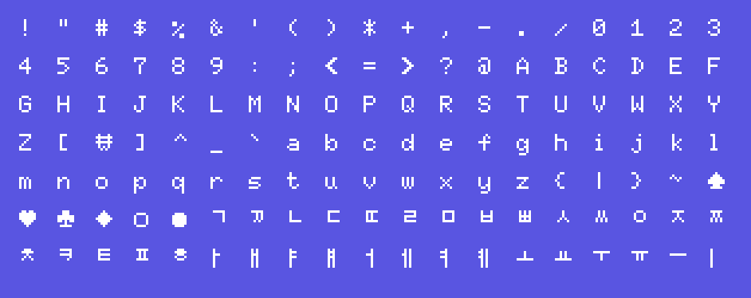
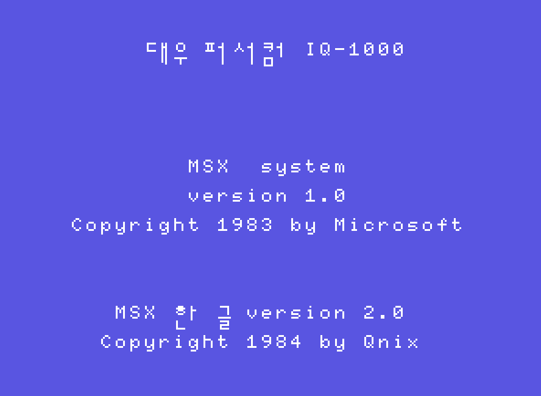

# Korean MSX Font

This is a modern recreation of the quirky Hangeul font used in Korean MSX computers in the 80s.

이 폰트는 80년대 한국산 MSX 컴퓨터에 사용된 별난 한글 글꼴을 현대적으로 재현한 것이다.
⚠️ **WARNING: This is a pre-alpha release. Use at your own risk!** ⚠️

## Live Demo
[View live demo](http://noahburney.net/msx-font/)

## Character set

## Examples
Daewoo IQ-1000 boot screen recreated with this font

